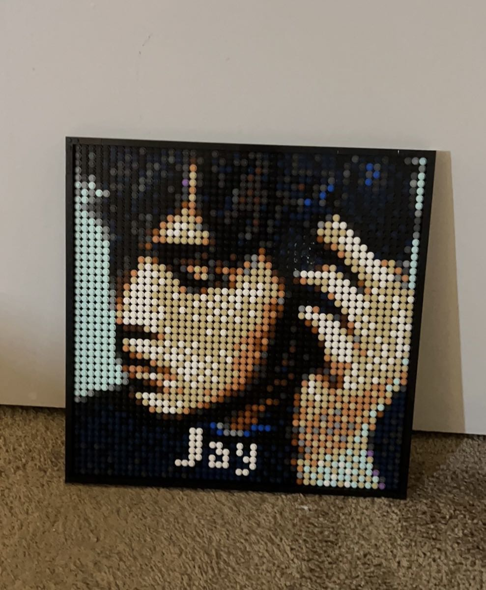

# Jacky's User Page

### Notice
- You may use `git clone` to clone this to your local machine
- You may want to read my [readme file](README.md)
- This site was built using [GitHub Pages](https://J4cky1ove.github.io/CSE110_Lab0-1)

> Jacky as a programmer
> 
1. implement Huffman coding tree data structure in CSE 100
2. implement Krushal's minimum spanning tree data structure in CSE 100
3. implement Prim's minimum spanning tree data structure in CSE 100

> Jacky as myself

*This is me when I was in childhood*

*This is the singer Jay zhou made by Lego*

### Course List
- [x] CSE 11 -- A
- [x] CSE 12 -- A+
- [x] CSE 15L -- A
- [x] CSE 30 -- A+
- [x] CSE100 -- A
- [ ] CSE110
